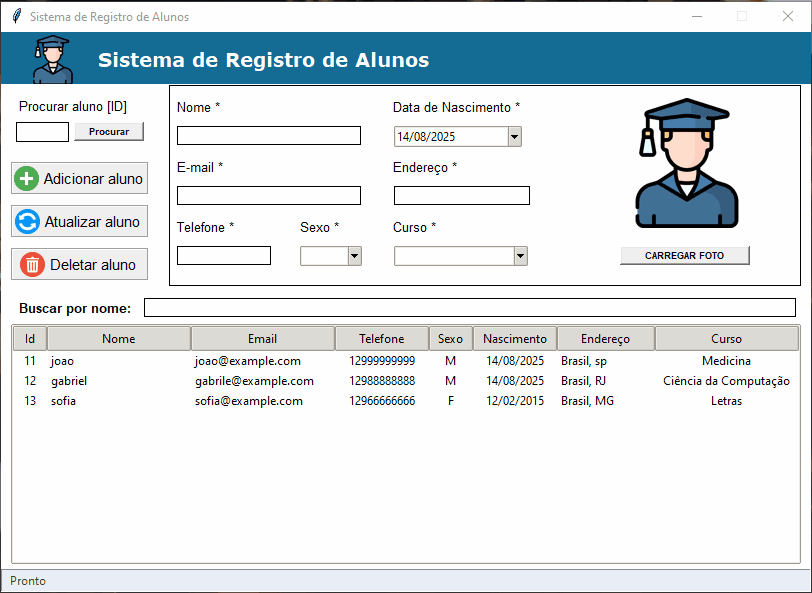

# Sistema de Registro de Alunos

Uma aplicação de desktop completa para gerenciamento de registros de estudantes, desenvolvida como um projeto prático para aprimorar habilidades em Python, na biblioteca de interface gráfica `tkinter` e em interações com banco de dados `SQLite`.

O projeto evoluiu de um script procedural simples para uma aplicação robusta e bem estruturada, seguindo os princípios da Programação Orientada a Objetos (OOP) и boas práticas de desenvolvimento.

---

## ✨ Funcionalidades Principais

* **Cadastro Completo (CRUD):** Crie, visualize, atualize e delete registros de alunos de forma intuitiva.
* **Interface Gráfica com Tkinter:** Interface limpa, organizada e amigável para o usuário.
* **Banco de Dados Local:** Utiliza `SQLite` para armazenar os dados de forma persistente e segura, criando o banco de dados automaticamente na primeira execução.
* **Upload de Fotos:** Permite associar uma foto a cada perfil de aluno.
* **Seleção Direta na Tabela:** Carregue os dados de um aluno no formulário simplesmente clicando na linha correspondente na tabela, agilizando a edição e visualização.
* **Busca Dinâmica por Nome:** Filtre a lista de alunos em tempo real digitando o nome no campo de busca.
* **Barra de Status Interativa:** Fornece feedback ao usuário sobre ações bem-sucedidas (ex: "Aluno salvo com sucesso") sem a necessidade de pop-ups interruptivos.
* **Máscara de Entrada para Telefone:** Formata automaticamente o campo de telefone no padrão brasileiro `(XX) XXXXX-XXXX`, melhorando a experiência do usuário e a padronização dos dados.

---

## 📸 Screenshot da Aplicação




---

## 🛠️ Tecnologias Utilizadas

* **Linguagem:** Python 3
* **Interface Gráfica:** Tkinter (biblioteca padrão do Python)
* **Banco de Dados:** SQLite3 (biblioteca padrão do Python)
* **Manipulação de Imagens:** Pillow (`PIL`)
* **Calendário:** tkcalendar

---

## ⚙️ Configuração e Instalação

Para executar este projeto em sua máquina local, o processo é bem simples.

**1. Pré-requisitos:**
* Ter o **Python 3** instalado em sua máquina.

**2. Baixe os Arquivos do Projeto:**
* Faça o download de todos os arquivos (`tela.py`, `main.py`, e as imagens `logo.png`, `add.png`, `update.png`, `delete.png`) e salve-os todos juntos na mesma pasta.

**3. Instale as Dependências:**
* Abra o seu Terminal (no macOS/Linux) ou o Prompt de Comando/PowerShell (no Windows) e execute os seguintes comandos para instalar as bibliotecas necessárias:

```bash
pip install Pillow

```

## ▶️ Como Executar

Com o Python instalado e as dependências prontas, basta executar o arquivo da interface:

```bash
python tela.py

```